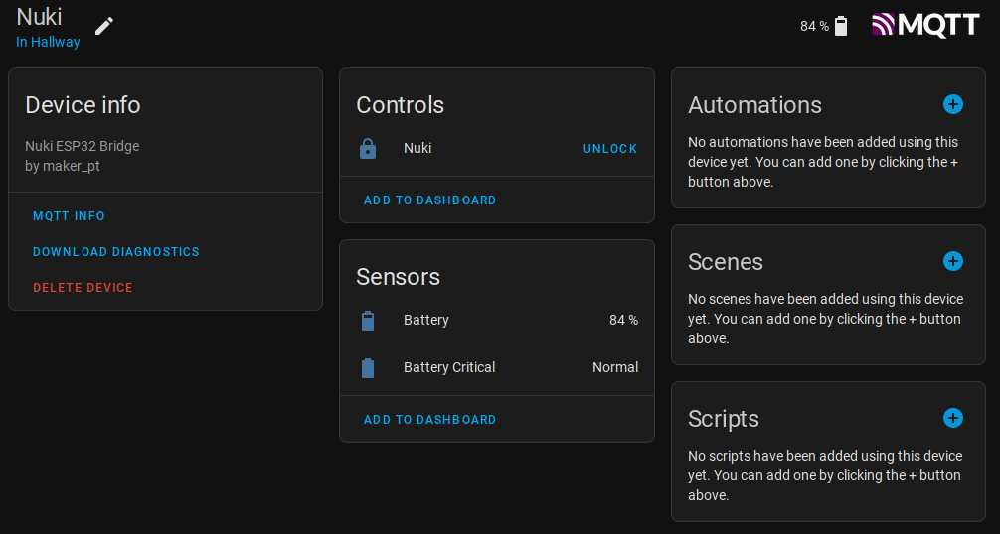

# NUKI ESP32 BRIDGE
This project allows to integrate a nuki lock with Home Assistant's MQTT integration and auto discovery using an additional ESP32. 

It's based on the NukiBleEsp32 library: https://github.com/I-Connect/NukiBleEsp32

It has been tested with a Nuki v3 and a LOLIN D32 with Home Assistant running on a pi4. 

## Use Cases
a) You want to automate locking, unlocking or opening doors using Home Assistant without buying an additional NUKI bridge. 

b) You want to control your NUKI lock via MQTT to integrate it into other automation systems. 

c) You could use this project as a starting point for more complex authentications for unlocking doors, e.g. using a secret knock or a finger print reader. 

## Initial Setup
 * Copy `config.h.sample` to `config.h` and adjust to your WiFi and MQTT credentials
 * Hint: The nuki pin is configured in your app to protect your configuration, however, the library needs it by default. If the pin has a leading 0, it should be ommited, e.g. pin 0123 should be written as 123. 
 * Deploy the project to your esp32 using platformio (you might have to change `upload_port` in `platformio.ini` to match your serial port)

## Pairing with your NUKI
 * Bring the lock within a few meters of your esp32
 * Power up the esp32
 * The blue led on the esp32 should light up
 * Hold the button on the Nuki for more than 5sek to set it into pairing mode
 * When the pairing is successful the blue led should turn off

## MQTT Topics
The esp32 registers its MQTT-topics under a command and a state topic. 

topic: `lock-[MAC]/lock/cmd`

Payloads: 
 * `lock`: locks the lock
 * `unlock`: unlocks the lock
 * `open`: unlatches the lock

topic: `lock-[MAC]/lock/state`
```json
{
  "state": "locked", # current state
  "battery": 84, # current battery percentage
  "battery_critical": "off" # nuki's warning if battery is low
}
```

## Home Assistant Auto Discovery
If the MQTT extension for HA is installed, and the config.h is configured to connect to the same MQTT broker, the lock should automatically appear in Home Assistant without further configuration. 



## Get a NUKI and ESP32:
You can buy a nuki lock directly from their website: 
https://shop.nuki.io/en/

Code for 30EUR off: REF6GQGS87DGY (let me know if it doesn't work anymore and you want a working code)

The ESP32, e.g. Lolin D32 can be acquired on Amazon: 
https://amzn.to/38GDcmo

## TODOs
These are some TODOs that the code still needs, feel free to create a PR if you want to participate. 

 * Clean up the code a bit
 * Use a web interface to setup mqtt and wifi or allow re-pairing to a lock
 * Extend state information if necessary


## Miscellaneous
This is a collection of interesting projects that could be realized using the nuki esp32 bridge: 

https://www.instructables.com/Secret-Knock-Detecting-Door-Lock/
